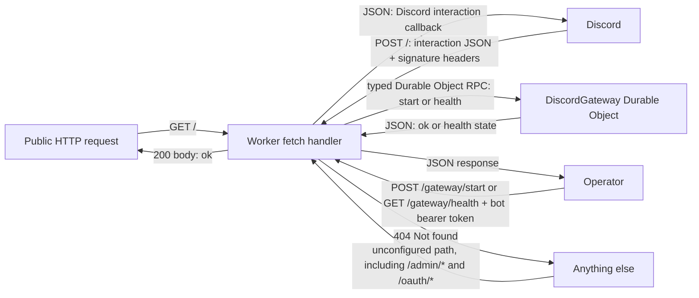
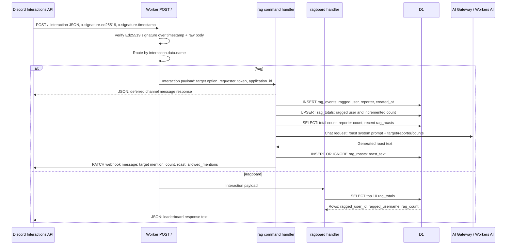
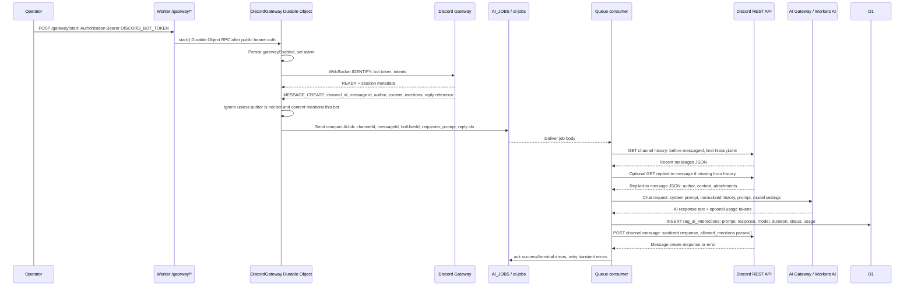

# RAG Discord Bot Design

## Overview

`ragbot-worker` is a Cloudflare Worker that handles:
- Discord interaction webhooks for slash commands
- A Discord Gateway connection via Durable Objects
- AI response generation via Workers AI and Cloudflare Queues
- D1-backed persistence for rag events, totals, and roast history

User-facing slash commands:
- `/rag user:<discord-user>`
- `/ragboard`

Mention-driven AI behavior:
- If a user mentions the bot in a normal message, the gateway path enqueues an AI job and posts a generated reply to the channel.

## Architecture

Core components:
- Worker entrypoint: `src/index.ts`
- HTTP helpers and signature verification: `src/http.ts`
- Slash command handlers:
  - `src/commands/rag.ts`
  - `src/commands/ragboard.ts`
- Mention queue producer/consumer logic: `src/mention.ts`
- Gateway ingestion and connection lifecycle: `src/gateway.ts`
- Command registration script: `scripts/register-commands.ts`

Cloudflare bindings from `wrangler.jsonc`:
- `DB` (D1)
- `AI` (Workers AI)
- `DISCORD_GATEWAY` (Durable Object)
- `AI_JOBS` queue producer
- `ai-jobs` queue consumer with DLQ `ai-jobs-dlq`

## Request and Event Flows

### Public Route Boundary

### Slash Command Flow

### Gateway Mention-to-AI Flow

## Command Behavior

### `/rag`

Inputs:
- required `user` option from Discord interaction data

Behavior:
- Validates target user option.
- Inserts event row into `rag_events`.
- Upserts total in `rag_totals` and increments `rag_count`.
- Reads current target total and reporter submission count.
- Reads recent roast history (`rag_roasts`) and generates a non-duplicate short roast using Workers AI.
- Falls back to deterministic roast lines if AI fails/duplicates/timeout.
- Stores roast line using `INSERT OR IGNORE`.
- Returns message with target mention, updated total, and roast.

### `/ragboard`

Behavior:
- Queries top 10 users from `rag_totals` ordered by count descending then user id.
- Returns ranked text leaderboard.
- Returns empty-state message if no data exists.

## Data Model

`rag_events`:
- immutable event stream of `/rag` submissions
- columns: `id`, `ragged_user_id`, `ragged_username`, `reported_by_user_id`, `reported_by_username`, `created_at`

`rag_totals`:
- aggregate materialization for fast leaderboard reads
- columns: `ragged_user_id` (PK), `ragged_username`, `rag_count`, `updated_at`

`rag_roasts`:
- dedupe memory for recent roast lines
- columns: `id`, `roast_text` (unique), `created_at`

## Security Model

- Interaction route enforces Discord Ed25519 signature verification.
- Invalid signatures return `401`.
- Gateway control endpoints use bearer token auth against the bot token before forwarding to the Durable Object.
- Any path not explicitly configured in the Worker route allowlist returns `404`.
- AI output is sanitized to remove mentions/IDs before posting.
- Channel posts include `allowed_mentions` restrictions.

## Operational Model

- `GET /` returns `ok` for basic health check.
- `GET /gateway/health` returns gateway connection status when called with the bot bearer token.
- Queue consumer processes one message at a time (`max_batch_size: 1`).
- Transient failures are retried with delay; terminal 4xx (except 429) are acknowledged to prevent poison retries.
