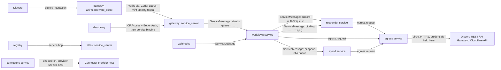

# RAG Discord Bot Design

## Overview

The system is a set of Cloudflare Workers, not a single worker. The gateway
(`ragbot-worker`) is the Discord-facing edge: it handles interaction webhooks
for slash commands, holds the Discord Gateway websocket connection via a
Durable Object, and enqueues work for the other services. AI response
generation (Workers AI and AI Gateway partner models), Discord writes, and AI
spend accounting each run in their own downstream service worker. D1 holds
rag events/totals, AI thread and interaction records, bans, and spend
accounting. See "Architecture" below for the full worker/package shape.

User-facing slash commands:
- `/rag user:<discord-user>`, `/ragboard`, `/undorag user:<discord-user>`,
  `/raghammer user:<discord-user> timeframe:<5m|1h|1d>`, `/ragunban
  user:<discord-user>` — the ragging game and its moderation.
- `/ask prompt:<question>` — AI thread creation.
- `/ragspend`, `/ragspendboard` — personal and leaderboard AI spend lookup.
- `/bicture prompt:<image-prompt>`, `/ragjam prompt:<music-prompt>
  [lyrics:<text>]` — queued generative-media commands.

Mention-driven AI behavior:
- If a user mentions the bot in a parent channel, the gateway path enqueues a fresh AI job that posts the generated reply directly in that channel.
- `/ask` is the only path that creates a new AI thread.
- Later messages inside bot-managed AI threads enqueue continuation jobs automatically and use only that thread's context.

## Architecture

The codebase is split by **role** (application vs. service) and, within each
application, by **layer**:

- `workers/applications/<id>/web` — any browser-facing UI (dev-proxy, registry).
- `workers/applications/<id>/api/middleware_client` — the public entrypoint:
  ingress guards, request shaping, OpenAPI/zod at the edge, and a signed
  service hop into the application's own `service_server` (never business
  logic itself).
- `workers/applications/<id>/service_server` — the non-public worker that
  verifies the signed hop and runs the actual application logic (Durable
  Objects, D1, domain handlers).

Applications today: `gateway`, `registry`, `attest`, `metadata`, `webhooks`,
`dev-proxy`. Services (no public route, no `web`/`api` split — a single
worker reached only by service binding or queue) live under
`workers/services/*`: `workflows`, `responder`, `spend`, `connectors`,
`egress`.

Core shared packages:
- `packages/auth` — the service-boundary client/server library: signed
  capnp `ServiceMessage` hops, `createClient`/`createServiceClient` (sending
  side) and `createServiceServer` (receiving side), manifests + registry
  client, and the placement control plane.
- `packages/authz` — the Cedar policy engine and `.cedar` policy files.
- `packages/identity` — Ed25519 identity-context token mint/verify and the
  committed public keyring.
- `packages/boundaries/inbound` — ingress guards (Discord signature,
  Cloudflare Access, the shared Better Auth session module, operator bearer
  token).
- `packages/boundaries/outbound` — the (now mostly legacy-path) direct egress
  boundary client, still used by the connectors broker's provider hosts and
  the Vault secrets backend.
- `packages/egress` — the sidecar's profile config and client/server halves
  (see below).
- `packages/domain` — command handlers, mention/thread logic, consumer
  processors.

Cloudflare bindings from `workers/applications/gateway/api/middleware_client/wrangler.jsonc`:
- `DB` (D1)
- `AI` (Workers AI)
- `DISCORD_GATEWAY` (Durable Object)
- `AI_JOBS` queue producer
- `ai-jobs` queue consumer with DLQ `ai-jobs-dlq`

### Signed service hops

Every worker-to-worker call (queue message or service-binding RPC) carries a
`ServiceMessage`: envelope bytes plus an Ed25519 JWS bound to a hash of the
envelope. The token is an on-behalf-of exchange (RFC 8693-style): `sub` is
the principal the request ultimately acts for, `act` is the delegation chain
accumulated across hops, and each hop re-mints with itself as issuer before
forwarding. Receivers verify signature/issuer/audience/expiry/payload-hash
**before** Cedar authorization, which itself runs **before** any handler
code. A client with no signing material, or whose Cedar `service.exchange`
check fails, fails closed on first use rather than per message.

New `(service, operation)` pairs must be registered in the sender's/
receiver's manifest before they are dispatchable — the **operation
registration gate** — so an unregistered envelope kind is refused at the
contract layer rather than reaching handler code.

### Placement control plane

Before a hop is minted, `packages/auth`'s placement layer records (or, in
enforcement mode, authorizes) the hop via the `ServiceRegistry` control
plane, returning a `requestId`/`placementId`/`correlationId` bound into the
token. Placement runs in one of three modes (test/no-op, record-only,
enforce); **on misconfiguration it now fails closed** — an unreachable or
misconfigured control plane denies the hop rather than silently letting it
through.

### Cedar authorization

Cedar (`@cedar-policy/cedar-wasm`) is the single authorization engine,
evaluated at two points on every service hop plus domain-specific actions:
- `service.exchange` — checked when a client is **built**, authorizing the
  zone transition (e.g. can `gateway` exchange into `workflows`).
- `service.invoke` — checked when a message is **received**, authorizing the
  concrete sender against the receiver.
- Domain actions layered on top: `command.*` (per-user Discord/dev-proxy
  command gate), `gateway.*` (e.g. `gateway.devproxy.invoke`, the dev-proxy
  capability surface), `connector.*` (the credential broker's admin +
  fetch/grant/token/webhook-verify ops), and `egress.use` (the egress
  sidecar's per-caller, per-profile authorization).

Policies live in `packages/authz/policies/*.cedar` (`commands`, `gateway`,
`connectors`, `egress`, `services`); the `ServiceRegistry` snapshot feeds
Cedar dynamic entities on top of static bootstrap permits.

### Egress sidecar

All outbound HTTP to Discord, the Cloudflare API, AI Gateway, and media
fetches now flows through the `egress` service worker as signed
`egress.request` hops rather than direct fetches from the calling
application. `DISCORD_BOT_TOKEN`, `CF_AIG_TOKEN`, and `CLOUDFLARE_API_TOKEN`
live only on the egress worker (the sole exception is the gateway's
`DiscordGateway` Durable Object, which still holds the bot token for the
websocket `IDENTIFY`). Bundled default profiles
(`packages/egress/profiles.ts`) mean a fresh deploy has working egress
before any `EgressControl` Durable Object seeding; DO-stored profiles
override the defaults. Deliberate exceptions that stay on the direct
`packages/boundaries/outbound` boundary client: the connectors broker's
per-connector provider hosts and the Vault secrets backend (both have
dynamic, credentialed, per-registration hosts where a wildcard egress
profile would be a security regression), and the 1Password SDK (does its
own HTTP, outside any boundary client).

### Attestation

`workers/applications/attest` follows the same
middleware→`ATTEST_SERVICE`→`service_server` pattern as the other
applications: the public middleware builds an `attest.invoke` envelope and
invokes `env.ATTEST_SERVICE`, which verifies and dispatches into the
service server's handlers — no logic lives in the public middleware itself.

### Discovery

The gateway serves a real `/.well-known/jwks.json` built from the committed
`packages/identity` keyring (`publicJwks`); discovery documents across the
applications no longer advertise `/oauth/*` endpoints that do not exist.

### Request and Event Flows

```mermaid
flowchart LR
  Discord[Discord] -->|signed interaction| Gateway[gateway: api/middleware_client]
  Gateway -->|verify sig, Cedar authz, mint identity token| GatewaySS[gateway: service_server]
  GatewaySS -->|ServiceMessage: ai-jobs queue| Workflows[workflows service]
  Workflows -->|ServiceMessage: discord-outbox queue| Responder[responder service]
  Workflows -->|ServiceMessage: binding RPC| Responder
  Workflows -->|ServiceMessage: ai-spend-jobs queue| Spend[spend service]
  Responder -->|egress.request| Egress[egress service]
  Workflows -->|egress.request| Egress
  Spend -->|egress.request| Egress
  Egress -->|direct HTTPS, credentials held here| External[Discord REST / AI Gateway / Cloudflare API]
  DevProxy[dev-proxy] -->|CF Access + Better Auth, then service binding| GatewaySS
  Registry[registry] -->|service hop| Attest[attest service_server]
  Webhooks[webhooks] -->|ServiceMessage| Workflows
  Connectors[connectors service] -->|direct fetch, provider-specific host| ProviderHost[Connector provider host]
```

## Command Behavior

### `/rag`

Inputs:
- required `user` option from Discord interaction data

Behavior:
- Validates target user option.
- Inserts event row into `rag_events`.
- Upserts total in `rag_totals` and increments `rag_count`.
- Reads current target total.
- Returns message with target mention and updated total.

### `/ragboard`

Behavior:
- Queries top 10 users from `rag_totals` ordered by count descending then user id.
- Returns ranked text leaderboard.
- Returns empty-state message if no data exists.

### `/ask`

Inputs:
- required `prompt` string option from Discord interaction data

Behavior:
- Defers the interaction response.
- Generates a concise AI title from the prompt.
- Creates a public Discord thread in the invoking channel.
- Stores thread metadata and the initial prompt in `rag_ai_threads`.
- Generates a fresh AI response and posts it inside the thread.
- Edits the original interaction response with a thread link.

### `/undorag`, `/raghammer`, `/ragunban`

Moderation over the rag event stream: `/undorag` deletes the target's most
recent `rag_events` row; `/raghammer` bans a target from `/rag` for a parsed
timeframe (`5m`/`1h`/`1d`-style, inserted into `rag_command_bans`); `/ragunban`
deletes any of that target's still-active ban rows early. All three are
admin-gated by Cedar `command.*` policy, not by application code.

### `/ragspend`, `/ragspendboard`

Read-only lookups over `rag_ai_spend_totals`: `/ragspend` returns the
invoking user's own accumulated estimated AI spend; `/ragspendboard` returns
the top 10 spenders. Totals are maintained by the spend service worker from
AI Gateway log cost reconciliation (see `packages/ai/spend.ts`), not computed
at query time.

### `/bicture`, `/ragjam`

Queued generative-media commands (image and music generation respectively).
Both enqueue a job (`bicture` / `ragjam` kind) carrying the prompt (and, for
`/ragjam`, optional lyrics) onto the AI job queue for the workflows worker,
which generates the media and edits the deferred interaction with the result
via the responder.

## Data Model

`rag_events`:
- immutable event stream of `/rag` submissions
- columns: `id`, `ragged_user_id`, `ragged_username`, `reported_by_user_id`, `reported_by_username`, `created_at`

`rag_command_bans`:
- time-boxed `/rag` bans issued by `/raghammer`, lifted early by `/ragunban`
- columns: `id`, `banned_user_id`, `banned_username`, `banned_by_user_id`, `banned_by_username`, `expires_at`, `created_at`

`rag_totals`:
- aggregate materialization for fast leaderboard reads
- columns: `ragged_user_id` (PK), `ragged_username`, `rag_count`, `updated_at`

`rag_ai_interactions`:
- audit log of AI generations (mention replies, `/ask`, thread continuations)
- columns: `id`, `kind`, `channel_id`, `message_id`, `requester_user_id`, `requester_username`, `prompt`, `response_text`, `model`, `ai_duration_ms`, `total_duration_ms`, `status`, `error_message`, `prompt_tokens`, `completion_tokens`, `total_tokens`, `created_at`

`rag_ai_threads`:
- tracks Discord threads owned by the AI chat flow
- columns: `id`, `thread_id` (unique), `parent_channel_id`, `source_message_id`, `requester_user_id`, `requester_username`, `initial_prompt`, `title`, `created_at`, `updated_at`

`rag_ai_spend_events`:
- raw per-request spend events pending/reconciled against AI Gateway log cost
- columns: `id`, `source_id` (unique), `kind`, `requester_user_id`, `requester_username`, `model`, `prompt_tokens`, `completion_tokens`, `total_tokens`, `unit_count`, `estimated_cost_micros`, `status`, `created_at`, `updated_at`

`rag_ai_requests`:
- lightweight per-user request log backing AI usage/burst limits
- columns: `id`, `requester_user_id`, `kind`, `created_at`

`rag_ai_spend_totals`:
- aggregate materialization behind `/ragspend` and `/ragspendboard`
- columns: `requester_user_id` (PK), `requester_username`, `estimated_cost_micros`, `event_count`, `updated_at`

Schema source of truth is `migrations/` (applied via `wrangler d1 migrations
apply`); `schema.sql` is a mirrored reference copy.

## Security Model

- The Discord interaction route enforces Ed25519 signature verification at ingress; invalid signatures return `401`.
- Gateway control endpoints (`/gateway/start`, `/gateway/health`) require the bot bearer token before the request reaches the `DiscordGateway` Durable Object.
- Any path not explicitly present in the generated route table returns `404`; each application's public surface is generated from its `application-bindings.ts` (`npm run routes:build`), so undocumented routes cannot silently exist.
- Every worker-to-worker hop is a signed `ServiceMessage` (see "Signed service hops" above) verified and Cedar-authorized before any handler code runs; this is the security boundary between workers, not network topology.
- All outbound HTTP that used to hold provider credentials in each application now flows through the egress worker (see "Egress sidecar" above), so a compromised application worker no longer has direct access to `DISCORD_BOT_TOKEN`, `CF_AIG_TOKEN`, or `CLOUDFLARE_API_TOKEN`.
- AI output is sanitized to remove mentions/IDs before posting; thread posts include `allowed_mentions` restrictions.

## Operational Model

- `GET /` on the gateway returns `ok` for a basic health check.
- `GET /gateway/health` returns gateway connection status when called with the bot bearer token.
- `GET /.well-known/jwks.json` on the gateway serves the committed Ed25519 public keyring so peers can verify signed service hops and identity tokens out of band.
- Each application/service worker's queue consumer processes one message at a time (`max_batch_size: 1`).
- Transient failures are retried with delay; terminal 4xx (except 429) are acknowledged to prevent poison retries.
- Deploy order is fixed (egress → connectors → responder → registry → attest → metadata → gateway → workflows → spend) so that every service binding target exists before the worker that depends on it deploys; `npm run deploy` / `deploy.sh` encode this order.
