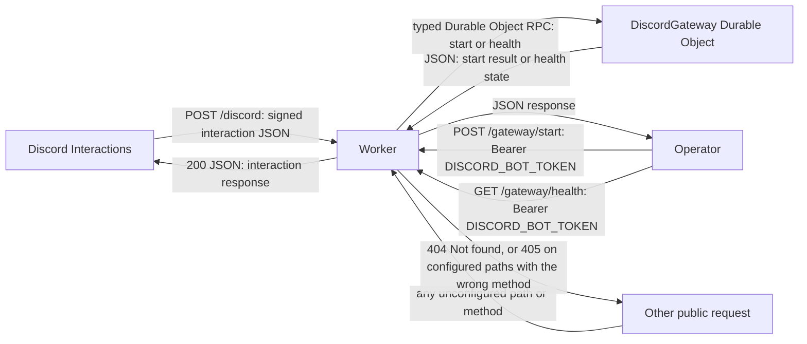
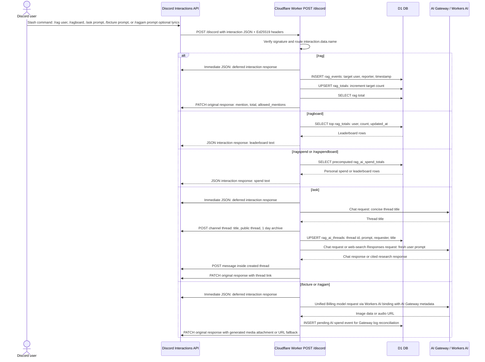
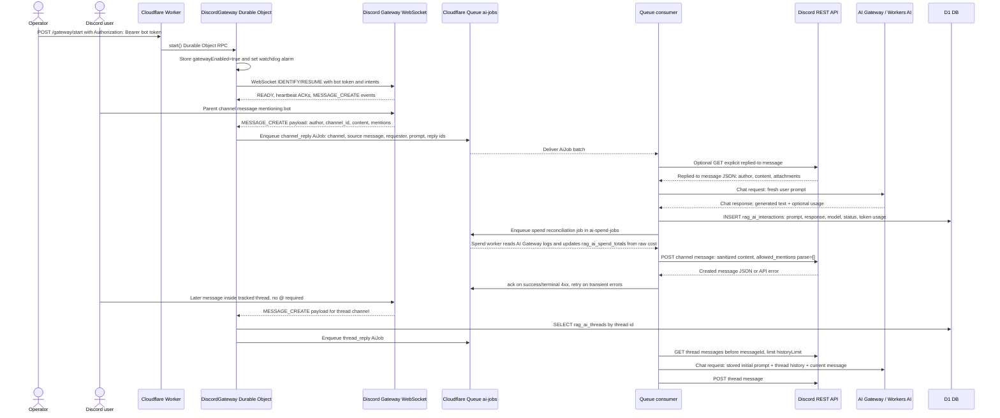

# ragbot-worker

Cloudflare Worker Discord bot for rag tracking, direct mention replies, and thread-based `/ask` conversations.

## Tech Stack

- Runtime: Cloudflare Workers (`src/index.ts`, `src/spend-worker.ts`)
- Language: TypeScript
- Database: Cloudflare D1 (`DB`)
- AI: Workers AI binding (`AI`) and AI Gateway REST; model and prompt config live in `src/ai-config` (`@cf/...` Workers AI models, Unified Billing partner chat models such as `grok/grok-4.3`, and web-search models such as `openai/gpt-4o-search-preview`)
- Queue: Cloudflare Queues (`AI_JOBS`, `ai-jobs`, `SPEND_JOBS`, `ai-spend-jobs`, dead-letter queues)
- Stateful connection: Durable Objects (`DiscordGateway`)
- Discord integration:
  - Interactions webhook
  - Discord REST calls for command registration, thread creation, and message posting
  - Gateway WebSocket for mention-based AI

## Command Surface

- Slash commands:
  - `/rag user:<discord-user>`
  - `/ragboard`
  - `/ragspend`
  - `/ragspendboard`
  - `/ask prompt:<question>`
  - `/bicture prompt:<image-prompt>`
  - `/ragjam prompt:<music-prompt> lyrics:<optional-song-lyrics>`
- HTTP endpoints:
  - `POST /discord` Discord interactions
  - `POST /gateway/start` start gateway connection (bot token auth)
  - `GET /gateway/health` gateway status (bot token auth)
- All other public paths, including `/` and source-file-looking paths, return `404`.

## Public Route Boundary

## Slash Command Flow

## Gateway Mention Flow

## Command-by-Command Details

### `/rag`

- Entry: interaction command routed in `src/index.ts`
- Handler: `src/commands/rag.ts`
- Data path:
  - insert `rag_events` row
  - upsert/increment `rag_totals`
  - read updated target total
- AI usage: none
- Response:
  - target mention + updated rag total

### `/ragboard`

- Entry: interaction command routed in `src/index.ts`
- Handler: `src/commands/ragboard.ts`
- Data path:
  - select top 10 from `rag_totals` ordered by `rag_count`
- Response:
  - ranked leaderboard text or empty-state message

### `/ragspend`

- Entry: interaction command routed in `src/index.ts`
- Handler: `src/commands/ragspend.ts`
- Data path:
  - reads the invoking user's precomputed total from `rag_ai_spend_totals`
- Response:
  - `<@user> has spent $x.xx`

### `/ragspendboard`

- Entry: interaction command routed in `src/index.ts`
- Handler: `src/commands/ragspend.ts`
- Data path:
  - selects top 10 from `rag_ai_spend_totals` ordered by AI Gateway log cost
- Response:
  - ranked spend leaderboard text or empty-state message

### `/ask`

- Entry: interaction command routed in `src/index.ts`
- Handler: `src/commands/ask.ts`
- Behavior:
  - defers the interaction
  - generates a concise AI thread title
  - creates a public Discord thread in the current channel
  - stores the thread in `rag_ai_threads`
  - posts the sanitized AI response inside the thread
  - automatically uses neutral web-search research mode when the prompt asks for current information
  - edits the original interaction response with a thread link

### `/bicture`

- Entry: interaction command routed in `src/index.ts`
- Handler: `src/commands/bicture.ts`
- Behavior:
  - defers the interaction
  - sends the prompt to the configured Unified Billing image model through the Workers AI binding and AI Gateway
  - records a pending AI spend event tagged with AI Gateway metadata
  - edits the original interaction response with the generated image attachment

### `/ragjam`

- Entry: interaction command routed in `src/index.ts`
- Handler: `src/commands/ragjam.ts`
- Behavior:
  - defers the interaction
  - sends `prompt`, `is_instrumental: false`, optional `lyrics`, and `lyrics_optimizer` to `minimax/music-2.6`
  - sets `lyrics_optimizer: true` when lyrics are omitted so the model auto-generates lyrics from the prompt
  - uses the configured AI Gateway id on the Workers AI binding for Unified Billing and spend reconciliation metadata
  - records a pending AI spend event tagged with AI Gateway metadata
  - downloads the generated audio URL and edits the original interaction response with a Discord audio attachment
  - falls back to the generated song URL if the audio cannot be attached

### Mention-based AI (not a slash command)

- Entry:
  - authenticated `POST /gateway/start` starts Durable Object gateway client
  - gateway listens for Discord `MESSAGE_CREATE`
- Handlers: `src/gateway.ts` (connection) and `src/mention.ts` (logic)
- Queue and worker:
  - parent-channel mentions enqueue a `channel_reply` job in `AI_JOBS`
  - channel reply jobs answer in the same Discord channel and do not create or record a thread
  - `/ask` creates a Discord thread, records it in `rag_ai_threads`, and posts the answer inside that thread
  - later messages in a tracked thread enqueue `thread_reply` jobs automatically without requiring an @ mention
  - reply jobs build context from the stored initial prompt plus recent messages in that thread only
  - generated replies are sanitized for mentions/IDs
- Delivery:
  - direct mentions post in the same Discord channel
  - `/ask` and tracked-thread follow-ups post inside the Discord thread

## Configuration

AI config is checked into `src/ai-config`:

- `discord-response.json` and `discord-response-system-prompt.md` control mention replies.
- `ask-web-search.json` and `ask-web-search-system-prompt.md` control `/ask` research mode.
- `bicture-image.json` controls `/bicture` image generation.
- `ragjam-music.json` controls `/ragjam` music generation.
- AI spend uses raw AI Gateway log cost. Requests are tagged with metadata so the spend worker can reconcile the exact log entry.

## Local and Deploy Commands

`./deploy.sh`

`npm run dev:all` runs the Discord worker plus the spend worker locally.

`npm run deploy` deploys both workers. Use `npm run deploy:main` or `npm run deploy:spend` to deploy one worker.
