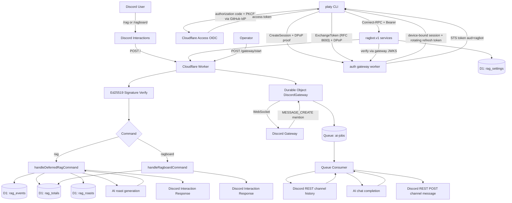

# ragbot-worker

Cloudflare Worker Discord bot for rag tracking and mention-triggered AI replies.

## Tech Stack

- Runtime: Cloudflare Workers (`src/index.ts`)
- Language: TypeScript
- Database: Cloudflare D1 (`DB`)
- AI: Workers AI binding (`AI`); model is runtime-configurable (`@cf/...` Workers AI models or partner models such as `xai/grok-4.3`), optionally routed through AI Gateway
- Queue: Cloudflare Queues (`AI_JOBS`, `ai-jobs`, `ai-jobs-dlq`)
- Stateful connection: Durable Objects (`DiscordGateway`)
- Admin auth: central auth gateway worker (`infra/applications/idp/worker`) that exchanges Cloudflare Access OIDC logins (GitHub IdP, authorization code + PKCE) for device-bound gateway sessions (DPoP, RFC 9449) and short-lived audience-scoped STS tokens (RFC 8693), with delegation-controlled identity chaining for service-to-service calls
- Service APIs: protobuf-first Connect-RPC services (`infra/proto`, generated code in `infra/applications`)
- AI Gateway service: `infra/applications/aigateway/worker` worker exposing `aigateway.v1.ChatService` — proxies chat completions to a Cloudflare AI Gateway with unified billing and an injected `cf-aig-authorization` token; callable by other apps (delegation) and the CLI (`./platy fetch aigateway.ChatService.Complete`, optionally `--as <app>`)
- Web chat client: `infra/applications/chat` React app (`chat.jsmunro.me`) with the browser auth SDK (DPoP via Web Crypto, OIDC PKCE, per-audience STS) and a Connect-Web streaming chat UI over the AI Gateway service (`npm run chat:build` bundles it)
- Infrastructure: `platy bootstrap` (Go CLI + cloudflare-go) creates the Access OIDC application, policy, and Cloudflare OAuth client directly via the Cloudflare API
- Discord integration:
  - Interactions webhook
  - REST API for command registration, message posting, and channel history
  - Gateway WebSocket for mention-based AI

## Command Surface

- Slash commands:
  - `/rag user:<discord-user>`
  - `/ragboard`
- HTTP endpoints:
  - `GET /` health
  - `POST /` Discord interactions
  - `POST /gateway/start` start gateway connection (bot token auth)
  - `GET /gateway/health` gateway status
  - `POST /ragbot.v1.<Service>/<Method>` Connect-RPC admin services (config, db, interactions, leaderboard, gateway control); requires a gateway-issued STS bearer token with audience `ragbot`
- CLI (`go run jsmunro.me/platy/cli`, binary `platy`): login, discovery, app registration, config management, db queries, interaction logs, gateway control, worker deploys

## End-to-End Flow Diagram



## Command-by-Command Details

### `/rag`

- Entry: interaction command routed in `src/index.ts`
- Handler: `src/commands/rag.ts`
- Data path:
  - insert `rag_events` row
  - upsert/increment `rag_totals`
  - read recent `rag_roasts`
  - insert generated roast into `rag_roasts`
- AI usage:
  - one short roast line via the configured roast model
  - fallback roast templates on timeout/error/duplicate
- Response:
  - target mention + updated rag total + roast line

### `/ragboard`

- Entry: interaction command routed in `src/index.ts`
- Handler: `src/commands/ragboard.ts`
- Data path:
  - select top 10 from `rag_totals` ordered by `rag_count`
- Response:
  - ranked leaderboard text or empty-state message

### Mention-based AI (not a slash command)

- Entry:
  - `POST /gateway/start` starts Durable Object gateway client
  - gateway listens for Discord `MESSAGE_CREATE`
- Handlers: `src/gateway.ts` (connection) and `src/mention.ts` (logic)
- Queue and worker:
  - gateway enqueues the raw mention job in `AI_JOBS`
  - consumer fetches recent channel history and builds a chat conversation
  - generates a reply with the configured model, sanitizes mentions/IDs
- Delivery:
  - posts message with Discord REST API

## Auth Platform Layout

- `infra/proto` protobuf definitions (`idp.v1`, `ragbot.v1`, `deploy.v1`), buf workspace
- `infra/applications/<app>/client|server` generated connect-go clients and protobuf-es servers
- `infra/applications/idp/worker` auth gateway worker: STS issuer (ES256, rotated keys in a Durable Object), application registry (D1), `GET /api/discovery`, `GET /.well-known/jwks.json`
- `infra/sdk/ts` worker-side SDK grouped into `verify/` (token, proof, and webhook verifiers), `auth/` (authenticators and the `protect` policy middleware), and `client/` (standardized fetch client with token sources and identity chaining)
- `infra/sdk/go` client SDK: Access PKCE login, device-bound DPoP sessions with automatic refresh, token cache, automatic STS exchange, discovery, standardized request client (`sdk/client`), Cloudflare delegated OAuth
- `infra/cli` the `platy` CLI
- `infra/applications/deploy/worker` deploy service worker: deploys workers with the caller's delegated Cloudflare OAuth token

## Configuration

Runtime config is stored in the D1 `rag_settings` table with code defaults in
`src/config.ts`, and managed through the `ragbot.v1.ConfigService` RPCs or the
`platy` CLI. See `AGENTS.md` for the key list, bootstrap steps, and CLI usage.

## Local and Deploy Commands

```bash
go build -o platy jsmunro.me/platy/cli
./platy deploy
```

Workers, registrations, and delegations are declared in
`infra/applications/applications.yaml`; `platy deploy` resolves secrets through
the 1Password SDK and injects them into wrangler, and `platy app sync`
reconciles the gateway registry with the manifest.
