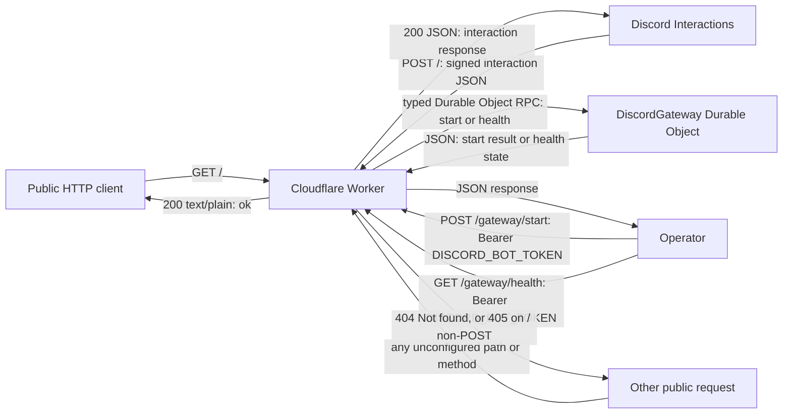
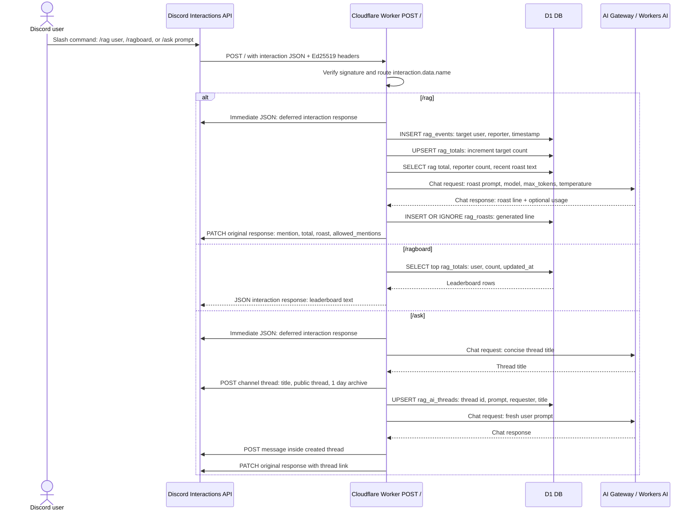
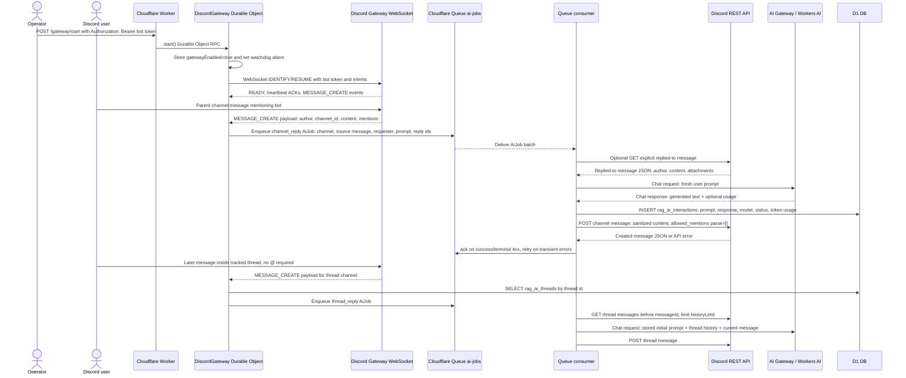

# ragbot-worker

Cloudflare Worker Discord bot for rag tracking, direct mention replies, and thread-based `/ask` conversations.

## Tech Stack

- Runtime: Cloudflare Workers (`src/index.ts`)
- Language: TypeScript
- Database: Cloudflare D1 (`DB`)
- AI: Workers AI binding (`AI`); model and prompt config live in `src/ai-config` (`@cf/...` Workers AI models or Unified Billing partner models such as `grok/grok-4.3`), routed through AI Gateway with binding options when a gateway id is configured
- Queue: Cloudflare Queues (`AI_JOBS`, `ai-jobs`, `ai-jobs-dlq`)
- Stateful connection: Durable Objects (`DiscordGateway`)
- Discord integration:
  - Interactions webhook
  - Discord REST calls for command registration, thread creation, and message posting
  - Gateway WebSocket for mention-based AI

## Command Surface

- Slash commands:
  - `/rag user:<discord-user>`
  - `/ragboard`
  - `/ask prompt:<question>`
- HTTP endpoints:
  - `GET /` health
  - `POST /` Discord interactions
  - `POST /gateway/start` start gateway connection (bot token auth)
  - `GET /gateway/health` gateway status (bot token auth)
- All other public paths return `404`.

## Public Route Boundary

## Slash Command Flow

## Gateway Mention Flow

## Command-by-Command Details

### `/rag`

- Entry: interaction command routed in `src/index.ts`
- Handler: `src/commands/rag.ts`
- Data path:
  - insert `rag_events` row
  - upsert/increment `rag_totals`
  - read recent `rag_roasts`
  - insert generated roast into `rag_roasts`
- AI usage:
  - one short roast line via the configured roast model
  - fallback roast templates on timeout/error/duplicate
- Response:
  - target mention + updated rag total + roast line

### `/ragboard`

- Entry: interaction command routed in `src/index.ts`
- Handler: `src/commands/ragboard.ts`
- Data path:
  - select top 10 from `rag_totals` ordered by `rag_count`
- Response:
  - ranked leaderboard text or empty-state message

### `/ask`

- Entry: interaction command routed in `src/index.ts`
- Handler: `src/commands/ask.ts`
- Behavior:
  - defers the interaction
  - generates a concise AI thread title
  - creates a public Discord thread in the current channel
  - stores the thread in `rag_ai_threads`
  - posts the sanitized AI response inside the thread
  - edits the original interaction response with a thread link

### Mention-based AI (not a slash command)

- Entry:
  - authenticated `POST /gateway/start` starts Durable Object gateway client
  - gateway listens for Discord `MESSAGE_CREATE`
- Handlers: `src/gateway.ts` (connection) and `src/mention.ts` (logic)
- Queue and worker:
  - parent-channel mentions enqueue a `channel_reply` job in `AI_JOBS`
  - channel reply jobs answer in the same Discord channel and do not create or record a thread
  - `/ask` creates a Discord thread, records it in `rag_ai_threads`, and posts the answer inside that thread
  - later messages in a tracked thread enqueue `thread_reply` jobs automatically without requiring an @ mention
  - reply jobs build context from the stored initial prompt plus recent messages in that thread only
  - generated replies are sanitized for mentions/IDs
- Delivery:
  - direct mentions post in the same Discord channel
  - `/ask` and tracked-thread follow-ups post inside the Discord thread

## Configuration

AI config is checked into `src/ai-config`:

- `discord-response.json` and `discord-response-system-prompt.md` control mention replies.
- `rag-roast.json` and `rag-roast-system-prompt.md` control `/rag` roast generation.

## Local and Deploy Commands

`./deploy.sh`
