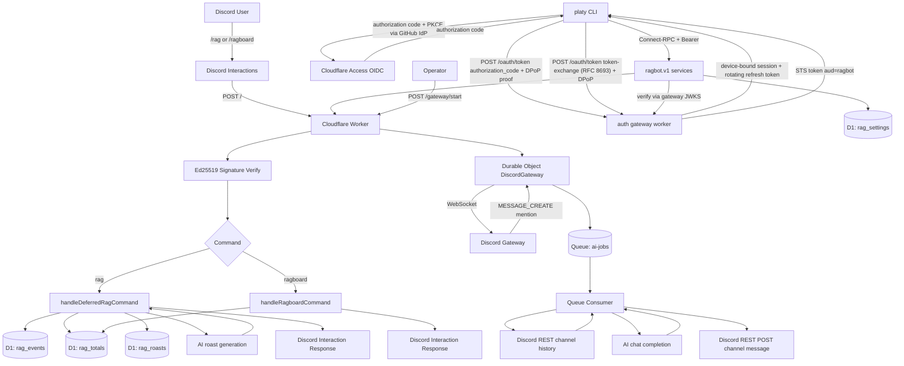

# ragbot-worker

Cloudflare Worker Discord bot for rag tracking and mention-triggered AI replies.

## Tech Stack

- Runtime: Cloudflare Workers (`src/index.ts`)
- Language: TypeScript
- Database: Cloudflare D1 (`DB`)
- AI: Workers AI binding (`AI`); model is runtime-configurable (`@cf/...` Workers AI models or partner models such as `xai/grok-4.3`), optionally routed through AI Gateway
- Queue: Cloudflare Queues (`AI_JOBS`, `ai-jobs`, `ai-jobs-dlq`)
- Stateful connection: Durable Objects (`DiscordGateway`)
- Admin auth: central auth gateway worker (`infra/applications/idp/worker`) that exchanges Cloudflare Access OIDC logins (GitHub IdP, authorization code + PKCE) for device-bound gateway sessions (DPoP, RFC 9449) and short-lived audience-scoped STS tokens (RFC 8693), with delegation-controlled identity chaining for service-to-service calls
- Service APIs: HTTP/OpenAPI under `/platform/<app>/v1/` (see `infra/applications/resources.yaml`)
- AI Gateway: `infra/applications/aigateway/worker` proxies chat completions to Cloudflare AI Gateway
- Web clients: `chat`, `console`, `portal` React apps with BFF workers (`createWebBffWorker`)
- Infrastructure: `infra/terraform` for Cloudflare Zero Trust, D1, queues; deploy with wrangler
- Discord integration:
  - Interactions webhook
  - REST API for command registration, message posting, and channel history
  - Gateway WebSocket for mention-based AI

## Command Surface

- Slash commands:
  - `/rag user:<discord-user>`
  - `/ragboard`
- HTTP endpoints:
  - `GET /` health
  - `POST /` Discord interactions
  - `POST /gateway/start` start gateway connection (bot token auth)
  - `GET /gateway/health` gateway status
  - Admin HTTP API: `/platform/ragbot/v1/*` (gateway JWT)

## End-to-End Flow Diagram



## Command-by-Command Details

### `/rag`

- Entry: interaction command routed in `src/index.ts`
- Handler: `src/commands/rag.ts`
- Data path:
  - insert `rag_events` row
  - upsert/increment `rag_totals`
  - read recent `rag_roasts`
  - insert generated roast into `rag_roasts`
- AI usage:
  - one short roast line via the configured roast model
  - fallback roast templates on timeout/error/duplicate
- Response:
  - target mention + updated rag total + roast line

### `/ragboard`

- Entry: interaction command routed in `src/index.ts`
- Handler: `src/commands/ragboard.ts`
- Data path:
  - select top 10 from `rag_totals` ordered by `rag_count`
- Response:
  - ranked leaderboard text or empty-state message

### Mention-based AI (not a slash command)

- Entry:
  - `POST /gateway/start` starts Durable Object gateway client
  - gateway listens for Discord `MESSAGE_CREATE`
- Handlers: `src/gateway.ts` (connection) and `src/mention.ts` (logic)
- Queue and worker:
  - gateway enqueues the raw mention job in `AI_JOBS`
  - consumer fetches recent channel history and builds a chat conversation
  - generates a reply with the configured model, sanitizes mentions/IDs
- Delivery:
  - posts message with Discord REST API

## Auth Platform Layout

- `infra/applications/resources.yaml` HTTP route and scope catalog
- `infra/applications/<app>/service` and `web` HTTP client factories
- `infra/applications/idp/worker` auth gateway: OAuth, STS, registry, traces
- `infra/sdk/ts` worker SDK (`http/`, `auth/`, `client/`, `verify/`)
- `infra/sdk/web` browser DPoP session and BFF request helpers

## Configuration

Runtime config is stored in the D1 `rag_settings` table with code defaults in
`src/config.ts`. Manage it via the console web app or the ragbot HTTP API.
See `AGENTS.md` for the key list and terraform setup.

## Local and Deploy Commands

```bash
npm install
npm run dev
npm run deploy
```
