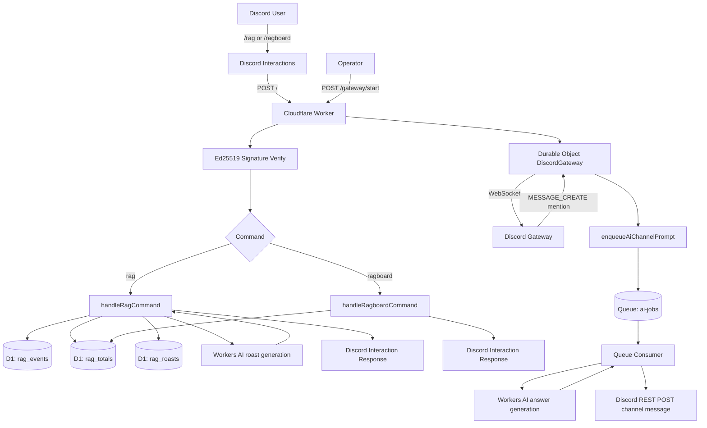

# ragbot-worker

Cloudflare Worker Discord bot for rag tracking and mention-triggered AI replies.

## Tech Stack

- Runtime: Cloudflare Workers (`src/index.ts`)
- Language: TypeScript
- Database: Cloudflare D1 (`DB`)
- AI: Workers AI (`AI`) using `@cf/meta/llama-3.1-8b-instruct`
- Queue: Cloudflare Queues (`AI_JOBS`, `ai-jobs`, `ai-jobs-dlq`)
- Stateful connection: Durable Objects (`DiscordGateway`)
- Discord integration:
  - Interactions webhook
  - REST API for command registration and message posting
  - Gateway WebSocket for mention-based AI

## Command Surface

- Slash commands:
  - `/rag user:<discord-user>`
  - `/ragboard`
- HTTP endpoints:
  - `GET /` health
  - `POST /` Discord interactions
  - `POST /gateway/start` start gateway connection
  - `GET /gateway/health` gateway status

## End-to-End Flow Diagram

## Command-by-Command Details

### `/rag`

- Entry: interaction command routed in `src/index.ts`
- Handler: `src/commands/rag.ts`
- Data path:
  - insert `rag_events` row
  - upsert/increment `rag_totals`
  - read recent `rag_roasts`
  - insert generated roast into `rag_roasts`
- AI usage:
  - Workers AI for one short roast line
  - fallback roast templates on timeout/error/duplicate
- Response:
  - target mention + updated rag total + roast line

### `/ragboard`

- Entry: interaction command routed in `src/index.ts`
- Handler: `src/commands/ragboard.ts`
- Data path:
  - select top 10 from `rag_totals` ordered by `rag_count`
- Response:
  - ranked leaderboard text or empty-state message

### Mention-based AI (not a slash command)

- Entry:
  - `POST /gateway/start` starts Durable Object gateway client
  - gateway listens for Discord `MESSAGE_CREATE`
- Handler: `src/discord-gateway.ts`
- Queue and worker:
  - enqueue job in `AI_JOBS`
  - consume in Worker `queue()` -> `processAiQueueMessage` in `src/commands/ai.ts`
- AI usage:
  - Workers AI generates channel reply
  - sanitizer strips mentions and IDs
- Delivery:
  - posts message with Discord REST API

## Local and Deploy Commands

`./deploy.sh`