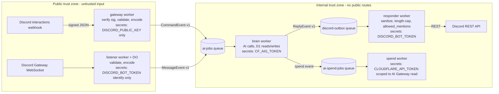

# Architecture & Security Recommendations

A review of ragbot-worker covering: (1) a target architecture that isolates the public
entrypoint from downstream workers via an event-driven pipeline, (2) security findings,
and (3) optimisations, simplifications, and general improvements.

Priorities: **P0** = do soon (real exposure or cheap high-value fix), **P1** = next,
**P2** = worthwhile, **P3** = nice to have.

## What is already good

Worth preserving through any refactor:

- Ed25519 verification is thorough (`src/http.ts`): header shape checks, ±5 min timestamp
  skew, hex validation, body parsed only after the signature passes, schema-validated
  interaction (`isDiscordInteraction`).
- Timing-safe bearer comparison (`src/timing-safe-equal.ts`).
- `allowed_mentions: { parse: [] }` discipline plus `sanitizeAiText` stripping mention
  syntax and snowflakes from model output — two independent layers against pings.
- All D1 access uses bound parameters; no string-built SQL.
- Fail-closed routing: anything but the three known paths is a 404 (`src/index.ts:143`).
- Queue payloads are re-validated at consume time (`isAiJob` in `src/validation.ts`).
- `.env` contains only 1Password references (verified across git history — no raw secrets).

---

## 1. Target architecture: gateway in front, workers behind

### The problem today

One worker (`src/index.ts`) is simultaneously:

1. the **public HTTP entrypoint** (raw internet input),
2. the **command executor** (D1 writes, AI calls, Discord REST — much of it inline in
   `ctx.waitUntil`),
3. the **queue consumer** (the `queue()` handler lives in the same default export),
4. the host of the **Durable Object** that holds a live Discord WebSocket.

Every secret (`DISCORD_BOT_TOKEN`, `CF_AIG_TOKEN`, and D1) lives in the same trust domain
as the code that parses untrusted internet payloads. A bug in any handler exposes
everything. There is also no single choke point where untrusted data becomes trusted:
`/ask` runs the full AI pipeline inline, mentions go through the queue, and `ragjam` is a
third hybrid.

### Target shape

Four workers, connected only by queues and service bindings. No internal worker has a
public route. Untrusted data is converted into a canonical, validated event exactly once,
at the edge; everything downstream consumes only typed events.



Key properties:

- **Gateway worker** does only: signature verification → schema validation → *encoding*
  into a canonical event → enqueue → immediate deferred response. It holds no bot token,
  no AI token, no D1 binding (the `/rag` family can stay here initially or move behind a
  service binding — see migration path). If the gateway is compromised, the attacker gets
  a public key and a queue producer, nothing else.
- **Workers never touch untrusted bytes.** The event envelope is where "encoded,
  validated" happens (see below). Consumers re-validate the envelope on receipt
  (zero-trust between hops — you already do this with `isAiJob`; keep it).
- **Responder worker is the single egress choke point.** It is the only holder of the
  bot token used for posting, and the only place `sanitizeAiText`, message length caps,
  `allowed_mentions`, and URL policy are applied. Today sanitisation is scattered across
  `mention.ts`, `ask.ts`, `discord.ts` — centralising it means a missed call site can't
  ship unsanitised model output.
- **The DO is treated as a second ingress**, because `MESSAGE_CREATE` payloads are
  untrusted user content. Today `handleGatewayMessageCreate` (called from inside the DO)
  does a D1 read (`findAiThread`) and a Discord REST call (`fetchBotRoleIds`) before
  enqueueing. Move that logic into the brain worker: the DO should validate → encode →
  enqueue and nothing else. (The DO must keep the bot token for `IDENTIFY`; that is
  unavoidable, but it should lose D1 and REST access.)

### The event envelope (the "encode, validate" step)

Create a shared `contracts` module (or package) that is the only definition of what
crosses a queue:

```ts
type EventEnvelope<T> = {
  v: 1;                                  // schema version, for rolling deploys
  type: "command.ask" | "command.bicture" | "command.ragjam"
      | "message.channel_reply" | "message.thread_reply" | "reply.post" | ...;
  id: string;                            // ULID, for idempotency/dedup
  occurredAt: string;                    // ISO timestamp
  source: "interactions" | "gateway";
  actor: { userId: Snowflake; username: string };
  guildId: Snowflake | null;
  payload: T;                            // strictly typed per event type
};
```

Validation rules applied at encode time (and re-checked at consume time):

- **Snowflakes must match `/^\d{17,20}$/`.** Today `channelId`, `messageId`,
  `replyChannelId` are validated only as "string" and are interpolated into Discord REST
  URLs (`src/discord.ts:10-14`, `fetchMessage`, `fetchChannelMessages`). A malformed ID
  from a compromised or buggy producer becomes path traversal into the Discord API
  (`../users/@me`). Cheap to close.
- **Length-cap free text at ingress**: prompt, lyrics, message content (Discord allows up
  to ~4–6k chars; decide your max, e.g. 2000, and truncate/reject at the edge). Today an
  oversized prompt flows straight into paid model calls.
- **Strip/normalise at the edge**: mention tokens, control characters. Downstream code
  then never needs to remember to.

Consider swapping the hand-rolled type guards in `src/validation.ts` for `zod` schemas in
the contracts module — one schema serves as validator, TypeScript type, and documentation,
and the guards are already ~170 lines of code that zod would halve.

### Migration path (incremental, each step ships alone)

1. **Unify all AI work onto the queue.** Move `/ask`'s inline pipeline
   (`src/commands/ask.ts:224` runs everything in `ctx.waitUntil`) into an
   `ask` job like `ragjam` already does. After this, every AI/spend path is queue-driven
   and the interaction handler only defers + enqueues. This also removes the risk of
   `waitUntil` being cut off mid-pipeline and is a prerequisite for the split.
2. **Split the queue consumer out of the public worker.** New `brain` wrangler config
   consuming `ai-jobs`; remove `queue()` from the public worker. The public worker loses
   `CF_AIG_TOKEN`.
3. **Add the responder/outbox.** Brain stops calling Discord REST directly; it emits
   `reply.post` events to `discord-outbox`. Responder holds the bot token. Public worker
   loses direct posting (it keeps only the deferred-response, which needs no token).
4. **Move the DO into its own listener worker** and thin it to validate→encode→enqueue.
5. **(Optional) Move the `/rag` family behind a service binding** so the public worker
   also loses D1. For a leaderboard toy this may not be worth it; the AI paths are where
   the money and abuse potential are.

Suggested repo layout once split (wrangler supports this cleanly with one config per
worker):

```
workers/
  gateway/        # public entrypoint
  listener/       # DO + websocket
  brain/          # ai-jobs consumer
  responder/      # discord-outbox consumer
  spend/          # ai-spend-jobs consumer (exists: src/spend-worker.ts)
src/
  contracts/      # event envelope + zod schemas (shared)
  discord/        # REST client (shared)
  ai/             # model client (shared)
```

---

## 2. Security findings

### 2.1 Secrets & credential blast radius

- **P0 — Stop using `DISCORD_BOT_TOKEN` as the control-plane password.**
  `/gateway/start` and `/gateway/health` authenticate with the raw bot token
  (`src/index.ts:38-41`, `deploy.sh:7`). The bot token is the highest-privilege Discord
  credential you have; it should never double as an API password for your own endpoints.
  Mint a dedicated `GATEWAY_CONTROL_TOKEN` secret (or drop the public control endpoints
  entirely and trigger the DO from a deploy-time script via `wrangler` / a service
  binding). Bonus: `deploy.sh` then stops passing the bot token through `curl` argv.
- **P1 — Scope `CLOUDFLARE_API_TOKEN` to AI Gateway Read.** It is only used to read
  gateway logs (`src/spend.ts:110-121`) and only in the spend worker. If it is currently
  an account-level token, an exploit in the spend worker becomes account takeover.
  Confirm it is set *only* on `ragbot-spend-worker`, not the main worker.
- **P2 — Interaction tokens transit the queue.** `ragjam` jobs carry `interactionToken`
  (`src/types.ts:62-71`), which allows posting as the bot for 15 minutes and will sit in
  `ai-jobs-dlq` on repeated failure. Acceptable risk, but worth knowing; the responder
  architecture naturally removes it (respond via bot-token REST to a channel id instead).

### 2.2 Ingress hardening

- **P0 — No rate limiting or spend caps anywhere.** Any member of the guild can loop
  `/bicture` and `/ragjam` (paid image/music generation) or spam mentions. You *track*
  spend but never *enforce* it. Two cheap layers:
  1. Per-user cooldown / token bucket at the gateway (Workers Rate Limiting binding, or a
     counter in the existing DO).
  2. A per-user daily budget checked against `rag_ai_spend_totals` + pending
     `rag_ai_spend_events` before enqueueing AI jobs, with a friendly "budget spent"
     reply.
- **P1 — Enforce a guild allowlist at runtime.** Commands are registered to one guild
  (`scripts/register-commands.ts:11`), but nothing at runtime checks `guild_id`, and the
  gateway listener processes `MESSAGE_CREATE` from *any* guild the bot gets invited to.
  Add `ALLOWED_GUILD_IDS` checked in both ingress paths (and decide the DM policy — the
  `DIRECT_MESSAGES` intent is enabled in `src/gateway.ts:34` but DMs are only implicitly
  half-handled).
- **P2 — Extend bans to AI commands.** `/raghammer` only blocks `/rag`
  (`src/commands/rag.ts:47`). The commands that cost money (`/ask`, `/bicture`,
  `/ragjam`, mentions) ignore bans, so the abuse-control tool doesn't cover the actual
  abuse surface. Check `rag_command_bans` in the shared pre-enqueue path.

### 2.3 Untrusted content, prompt injection & egress

- **P1 — Cap and constrain model-returned URL fetches.** Two places fetch URLs that come
  out of an AI response: `bicture` image download (`src/commands/bicture.ts:73-80`) and
  `ragjam` audio download (`src/commands/ragjam.ts:84-99`). ragjam caps at 25 MB; bicture
  buffers the whole body with **no size cap** and no timeout. Add: size cap, timeout, and
  ideally a host allowlist (the generation providers' CDN domains). This is the classic
  "worker handles data an upstream service was tricked into producing" path.
- **P1 — Decide a URL policy for model output posted to channels.** `sanitizeAiText`
  (`src/ai.ts:191`) strips mentions and IDs but not links, and prompt injection (including
  via *other users'* messages and attachment URLs pulled into context by
  `formatReplyContext`, `src/mention.ts:85-105`) can make the bot post attacker-chosen
  URLs with the bot's authority. Cheapest meaningful mitigations: wrap non-cited URLs in
  `<...>` (suppresses embeds/previews), or strip URLs except web-search citation sources.
- **P2 — Apply timeouts to all external fetches.** `withTimeout` exists in `src/ai.ts:397`
  but is dead code — nothing uses it. AI Gateway calls, Discord REST, and media downloads
  all run uncapped inside queue consumers; a hung upstream burns invocation time and
  stalls the (batch size 1) queue. Either wire it in everywhere (and `clearTimeout` on
  settle so the timer doesn't pin the isolate) or use `AbortSignal.timeout()`.

### 2.4 Data protection & retention

- **P2 — Unbounded retention of user content.** `rag_ai_interactions` stores every
  prompt and response forever; `rag_ai_threads.initial_prompt` likewise. For a private
  guild bot this is a judgement call, but a scheduled cleanup (cron trigger, delete rows
  older than N days, keep the aggregates) shrinks both the privacy exposure and the D1
  bill.
- **P3 — Log hygiene.** `ragjam_audio_download_failed` logs the full audio URL and
  bicture's `errorDetails` serialises arbitrary error properties (can include response
  bodies). Trim to what you'd want in a third party's hands.

### 2.5 Supply chain & CI

- **P0 — CI never runs the tests.** `.github/workflows/check.yml` runs `npm run check`,
  which is `tsc --noEmit` only. You have a genuinely good ~3200-line test suite covering
  the auth boundary (`test/index.test.ts`) that only runs if someone remembers to run it
  locally. Add `npm test` to the workflow (and consider making pre-commit run it too, or
  at least keep CI as the backstop).
- **P2 — Pin GitHub Action versions to SHAs** (`actions/checkout@v4` → full commit SHA)
  and add Dependabot/`npm audit` to CI.
- **P2 — `preview_database_id` is the production database id** in both wrangler configs.
  Any preview deployment reads and writes prod data. Point it at a separate D1 database
  (or remove it).

---

## 3. Optimisations, simplifications, general improvements

### Dead code (delete)

- `withTimeout` (`src/ai.ts:397`) — unused, and as written the loser's timer keeps the
  isolate alive. Delete or wire in (see 2.3).
- `runChatModel` (`src/ai.ts:272`) — unused wrapper.
- `CONFIG_DEFAULTS` / `isConfigKey` / `ConfigKey` (`src/config.ts:26-40`) — exported,
  never imported; `loadConfig(_env)` ignores its argument entirely. Looks like a leftover
  from a D1-backed config system. Delete, and drop the unused `_env` parameter.
- The duplicate-insert fallback in `recordAiInteraction` (`src/mention.ts:438-464`)
  retries the INSERT without the token columns — a shim for a pre-migration schema.
  Once prod has the current schema, delete the fallback.

### Duplication (consolidate)

- **Display-name resolution is written four times**: `src/commands/ask.ts:43`,
  `src/commands/bicture.ts:194`, `src/commands/ragjam.ts:47`, and
  `getMessageAuthorDisplayName` in `src/mention.ts:107`. One `getDisplayName(...)` in
  `rag-utils.ts` (or a new `discord-utils.ts`).
- **`errorDetails` is copy-pasted** in `bicture.ts:168` and `ragjam.ts:108` → move to
  `logger.ts`.
- **The defer-then-edit boilerplate** (`ctx.waitUntil` + `editOriginalInteractionResponse`
  + catch-and-apologise) is repeated in `rag.ts:97`, `ask.ts:224`, `bicture.ts:264`. One
  helper: `deferAndEdit(interaction, ctx, run, failureMessage)`. (If you take the
  architecture step of queueing everything, this collapses further.)
- **The three AI branches in `processAiQueueMessage`** (`src/mention.ts:513-613`) each
  repeat the same ~20 lines of spend-source-id + usage extraction + `recordAiSpendEvent`.
  Extract `const tracked = await runTrackedCompletion(env, kind, attribution, () => ...)`
  that returns `{content, model, usage}` and records spend once. Same pattern would also
  serve `ask.ts` and `generateThreadTitle`.
- `MAX_DISCORD_MESSAGE_LENGTH` is defined as 1900 in `mention.ts:28` and `ask.ts:32`, and
  2000 in `ragjam.ts:16` — one constant in `types.ts` (or the future contracts module).
- `buildConversation` (`src/mention.ts:400`) just calls `buildNormalThreadConversation`
  and throws away `.thread`; the call site already special-cases `thread_reply`. Inline it.
- `fetchChannelMessages` / `fetchMessage` / `fetchUsername` (`src/discord.ts`) each
  hand-roll fetch + ok-check + json-parse instead of using the existing
  `discordJsonRequest`. Unify (add an option for "return null on !ok" vs throw).

### Structure

- **Route commands with a map instead of a 10-branch if-chain** (`src/index.ts:89-133`):
  `const handlers: Record<string, CommandHandler> = { rag: ..., ask: ..., ... }`. Adding
  a command becomes one line, and the map doubles as the registry the future gateway
  worker validates against.
- **Split `mention.ts` (657 lines).** It currently contains mention parsing, thread
  persistence, conversation building, title generation, *and* the queue consumer. Natural
  seams: `threads.ts` (D1 thread store), `conversation.ts` (history/context building),
  `consumer.ts` (queue processing). This mirrors the eventual worker split, so it's a
  cheap first step toward Section 1.
- **Split `test/index.test.ts` (3170 lines)** along the same seams.
- **Move `discord.js` to `devDependencies`.** It is only imported by
  `scripts/register-commands.ts`; in `dependencies` it inflates installs and `npm audit`
  surface for the worker, which never uses it.

### Performance / cost

- **Make `/ask` respond faster and cheaper.** Today it serially: generates an AI title
  (a paid model call), creates the thread, runs the main completion, then posts — all
  before the user sees anything but "thinking". Options, independently applicable:
  - Derive the title from the prompt (`sanitizeThreadTitle(prompt)` already exists as the
    fallback) and skip the title model call entirely — one fewer paid call per `/ask`.
  - Create the thread first and edit the deferred response with the thread link
    *immediately*, then let the answer arrive in-thread (this is exactly what the
    queue-based flow in Section 1 gives you).
- **`/rag` round trips**: the batch insert is followed by a separate `SELECT` for the
  total (`src/commands/rag.ts:57-69`). D1 supports `RETURNING`; `UPDATE ... RETURNING
  rag_count` in the batch drops a query. Same pattern in `undorag.ts`.
- **Spend reconciliation is O(pages × retries) per event.** Each spend job lists up to
  150 gateway log entries and string-matches metadata, retrying up to 5 times on a
  2-minute delay (`src/spend.ts:110-142`). If the AI Gateway logs API supports metadata
  filters, use them; otherwise consider a single cron that reconciles all pending events
  against one log listing pass, instead of per-event scans.
- **`ai-jobs` batch size is 1** (`wrangler.jsonc:78`) — fine at current volume, but the
  consumer loop is already batch-shaped; raising it later is free once timeouts exist.

### Operational

- **No way to stop the gateway.** `gatewayEnabled` is set true and never unset
  (`src/gateway.ts:110-113`); the watchdog alarm reconnects forever. Add a
  `POST /gateway/stop` (with the new control token) that clears the flag and closes the
  socket — you'll want it the first time the bot misbehaves.
- **DLQs have no consumer or alerting.** `ai-jobs-dlq` / `ai-spend-jobs-dlq` accumulate
  silently until retention expires. Cheapest fix: a tiny consumer that logs at error
  level so observability picks it up.
- **Migrations**: `schema.sql` is applied via `d1 execute` with `IF NOT EXISTS`, which is
  why `recordAiInteraction` needs its dual-insert shim. `wrangler d1 migrations` gives
  ordered, tracked migrations and removes the guesswork.
- **`editOriginalInteractionResponse` ignores failures** (`src/discord.ts:233` — the
  fetch result is discarded). Log non-ok responses; silent edit failures are invisible
  today.

---

## 4. Suggested sequencing

| Phase | Items | Outcome |
|---|---|---|
| 1 — this week | Tests in CI (2.5); control token for `/gateway/*` (2.1); rate limit + daily budget check (2.2); bicture download cap/timeout (2.3) | Closes the live exposure cheaply, no restructuring |
| 2 — quick cleanups | Dead code removal, duplication consolidation, `discord.js` → devDeps, command map, split `mention.ts` (§3) | Smaller, clearer codebase before the split |
| 3 — unify on events | `/ask` (and `/rag` edit path) onto `ai-jobs`; contracts module with envelope + snowflake/length validation | Single ingress→queue→worker shape; "no worker touches untrusted data" becomes true in code |
| 4 — split trust zones | Brain worker (queue consumer) out of public worker; responder/outbox worker owns bot token + sanitisation; thin the DO to encode+enqueue | Least-privilege secrets per worker; public entrypoint holds only the public key |
| 5 — hardening tail | Guild allowlist, ban coverage for AI commands, retention cron, D1 migrations, DLQ alerting, gateway stop endpoint | Operational maturity |
